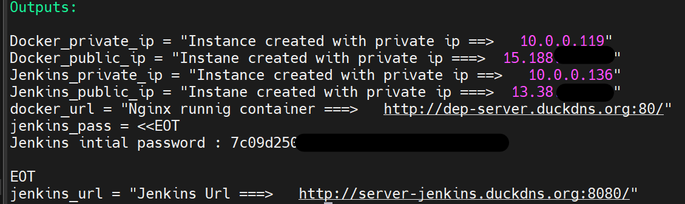

# Automation of Infrastructure Provisioning (IaC) and Configuration for your future CI/CD
## V1
## Project Description

This project demonstrates the setup of a basic infrastructure using Terraform creating two EC2 servers and configuring them using Ansible for different purposes.

### Overview

1. **Instance 1: Jenkins, Ansible, and Terraform**
   - **Jenkins**: Automation server for continuous integration and continuous delivery (CI/CD).
   - **Ansible**: Configuration management tool for automating provisioning and application deployment.
   - **Terraform**: Infrastructure as Code tool for defining and provisioning infrastructure.

2. **Instance 2: Docker with Nginx Container**
   - **Docker**: Containerization platform for packaging and running applications.
   - **Nginx**: Web server running inside a Docker container.

## To start the application
### Prerequisites
- Terraform
- Ansible
- Duckdns account for the Jenkins server and deployment Domains
- Generate keypair using ```ssh-keygen -t rsa -b 4096 ```
- Ensure AWS CLI is configured with IAM access (see "Configure AWS CLI with IAM Access" section).


### Configure AWS CLI with IAM Access

Before applying the Terraform configuration, ensure that your AWS CLI is configured with the necessary IAM access. If you haven't done this yet, follow these steps:

1. **Install AWS CLI:** Follow the instructions at [AWS CLI Installation Guide](https://docs.aws.amazon.com/cli/latest/userguide/cli-configure-files.html).

2. **Configure AWS CLI with your IAM credentials:**

   Open your terminal and run the following command:

   ```bash
   aws configure

### Steps

**Step 0**: Clone the repository 
 
    git clone https://github.com/YahyaLafdi/terraform-project.git

**Step 1**: Navigate to the project directory
 
    cd terraform-project


**Step 2**: Create DuckDns account and domains and      update `` modules/ec2_modules/variables``   with token and domain names

**Step 3**: Provision and configure your servers

    terraform apply --auto-approve
    

**Step 4**: access jenkins and configure your pipeline *(everything is in the output)*

    http://public-ip:8080/          OR 
    http://{domain-name}.duckdns.org:8080/

you can find the init password at `` ~/password/jenkinspassword``   Or in the output :

## Terraform output: 


**Step 5**:   run the jenkins pipeline
### Cleanup


    terraform destroy --auto-approve

# **Note**
## *State File*
 ### State file storing
  - i have moved the statefile to an object storing in our case s3
  - I have used backend  ` .tf ` file to enable remote storing and use of the ` .tfstate` file remotly and not locally
  - also i created a DynamoDB resource to use for locking the state file to prevent concurrent modification of the infrastructre.
   - create you s3 Bucket and replace the name and Region in the `` backend.tf`` file
 ## * State file Best Practice *
>    you should avoid storing the state file in the VCS as it may discolse information regarding the Inrastructure (access keys , private keys , passwords ....)
>    instead use Remote object storage with proper permissions 


